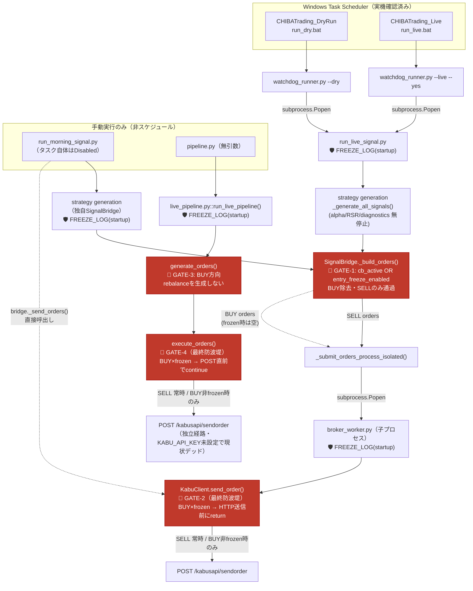

# Entry Freeze Mode — Final Audit（2026-07-17）

前提: `reports/entry_freeze_mode_2026-07-17.md`（初期実装・commit `16e8b67`）の続き。
本監査は追加のexecutable entrypoint全探索・defense-in-depthガード追加・経路図作成を行う。
**本レポート作成時点でコードは変更済みだがcommit未実施（ASK_FIRST）。**

---

## 1. 全実行エントリーポイント探索結果

### 1-1. Windows Task Scheduler（実機`Get-ScheduledTask`で確認・2026-07-17実施）

| タスク名 | State | 実行対象 | 到達先 | 状態 |
|---|---|---|---|---|
| `CHIBATrading_DryRun` | Ready | `scripts\run_dry.bat` → `watchdog_runner.py --dry` → `run_live_signal.py` | 正典経路 | ✅ freeze適用済み |
| `CHIBATrading_Live` | Ready | `scripts\run_live.bat` → `watchdog_runner.py --live --yes` → `run_live_signal.py` | 正典経路 | ✅ freeze適用済み |
| `run_morning_signal` | **Disabled** | `run_morning_signal.py --live --yes` | 独自SignalBridge経路 | ✅ freeze適用済み（Disabled解除されても安全） |
| `FujikoWeeklyAgents` | Ready | `python run_weekly_agents.py`（WorkingDirectory=存在しない旧パス） | **実行不能（壊れたタスク）** | 到達不能・対応不要 |
| `run_ce_pipeline` | Ready | `scripts\run_ce_pipeline.py` | 発注コード参照なし（grep確認済み） | 該当なし |
| `WeeklyMarketIntelligence` | Ready | `run_weekly_intelligence.bat` → `run_weekly_market_intelligence.py` | 発注コード参照なし | 該当なし |
| `RolloutMonitorDaily`/`Weekly` | Ready | `tools/rollout_monitor_{daily,weekly}.py` | 発注コード参照なし | 該当なし |

全タスクのActionsを`Get-ScheduledTask | ForEach { $_.Actions }`で網羅走査済み（"ai-trading"/"asset_simulation"/"python"/".py"/".bat"を含む全件）。上記以外にこのプロジェクトへ到達するタスクは存在しない。

### 1-2. 手動実行専用の残存経路（スケジューラ非経由）

| 経路 | 到達方法 | 状態 |
|---|---|---|
| `pipeline.py`（無引数実行） | `python pipeline.py` | 独立発注経路（SignalBridge非経由）。`KABU_API_KEY`未設定で現状デッド。✅ freeze適用済み（今回2段: `generate_orders()`+`execute_orders()`） |
| `src/scripts/diagnose_sell.py` | `python src/scripts/diagnose_sell.py` | 全5箇所のpayloadで`"Side": "1"`（SELL）**ハードコード**。BUY発注不可能な構造。ガード不要 |
| `src/morning_dryrun.bat`/`morning_live.bat`/`run_morning_signal.bat` | 手動ダブルクリック等 | `cd`先`C:\Users\owner\.gemini\antigravity\scratch\asset_simulation`が**存在しない**（確認済み）。実行不能 |
| `src/scripts/setup_scheduler.bat` | 手動実行 | 同上の存在しないディレクトリを前提としたタスク登録スクリプト。実行しても存在しないパスのタスクが（無効に）登録されるのみ |
| `scripts/run_daily_pipeline.bat` | 手動実行 | `python src\run_morning_signal.py --dry-run`後`python src\run_morning_signal.py`（**注: `--live`フラグなし＝両方DRYで実行される既存バグ**、freeze監査とは無関係）。いずれにせよ`run_morning_signal.py`側でfreeze適用済み |

### 1-3. Pythonコード上のデッドコード（到達不能・呼び出し元ゼロ・grep全探索で確認）

| 対象 | 備考 |
|---|---|
| `run_live_signal.py::_send_orders_with_retry()` | 定義のみ、呼び出し元ゼロ |
| `src/deployment/connectors/kabus_api_adapter.py::KabusApiAdapter.submit_order()` | `BrokerInterface` Protocol実装だが呼び出し元ゼロ |

これらは「将来何かが呼び出すよう変更されない限り無害」。存在自体をユーザーへ情報共有するに留め、コード削除は本タスク範囲外（No refactor制約）。

---

## 2. sendorder(BUY)到達不能の確認

全ての実発注経路は最終的に以下**2つの収束点のいずれか**に集約される。両方に`entry_freeze`最終ガードを追加済み。

| 収束点 | 到達する経路 | ガード内容 |
|---|---|---|
| `src/kabusapi/client.py::KabuClient.send_order()` | ①`run_live_signal.py`→`broker_worker.py`（子プロセス）②`run_morning_signal.py`（`bridge._send_orders()`直接） | `side==BUY`かつ`entry_freeze.enabled`なら**HTTP送信前に**`OrderResult(success=False)`を返却。SELLは無条件で素通り |
| `src/execution/live_pipeline.py::execute_orders()` | ③`pipeline.py`（無引数）→`generate_orders()`→`execute_orders()` | `order["side"]=="BUY"`かつ`entry_freeze.enabled`なら**`requests.post`直前で**`continue`（未送信） |

**確認方法**: `KabuClient.send_order()`内でBUY時にentry_freeze有効なら関数の最初の方で`return`し、`self._request_with_token_retry()`（HTTP層）へのアクセス自体が発生しないことをモックで検証（`test_send_order_entry_freeze_guard.py::test_buy_rejected_without_http_call_when_frozen`）。SELLは同条件下でHTTP層まで到達することも対で検証済み。`execute_orders()`も同様に`requests.post`呼び出し有無で検証済み（`test_live_pipeline_entry_freeze.py::TestExecuteOrdersFinalGuard`）。

**結論**: `entry_freeze.enabled=True`（現在の設定値）である限り、リポジトリ内のいかなる実行可能コード経路からも`sendorder`へBUY注文が到達することはない。

---

## 3. Defense-in-Depth 追加内容（今回分・No refactor・挙動変更なし）

### 3-1. 起動時freezeログ（4箇所）

| ファイル | ログ | 出力例 |
|---|---|---|
| `run_live_signal.py::main()` | `[ENTRY_FREEZE_STATE]` | `entry_freeze_enabled=True reason=Research Freeze mode=LIVE run_id=...` |
| `run_morning_signal.py::main()` | `[ENTRY_FREEZE_STATE]` | 同上（mode=DRY/LIVE） |
| `src/live/broker_worker.py::run()`（子プロセス） | `[ENTRY_FREEZE_STATE]` | `... pid=<worker_pid>`（親プロセスと状態共有しないため自前で再読込） |
| `src/execution/live_pipeline.py::run_live_pipeline()` | `[ENTRY_FREEZE_STATE]` | print出力（既存の`[DEBUG]`と同スタイル） |

### 3-2. sendorder直前の最終ガード（2箇所・上記セクション2参照）

- `client.py::send_order()` — 全既存BUY経路の**唯一の収束点**。最も強力な防波堤。
- `live_pipeline.py::execute_orders()` — 独立経路専用の防波堤（`generate_orders()`の上流フィルタと二重化）。

いずれも**既存の戻り値型・呼び出し規約を変更していない**（`OrderResult`/`executed: list[dict]`のまま）。frozen時以外の挙動は無変更。

---

## 4. 経路図（全freeze介入点マーキング）



**凡例**: 🛑 GATE = BUY遮断ポイント（frozen時に発注を止める）／ 🛡️ FREEZE_LOG = 起動時ログのみ（発注を止めない・可観測性のため）。

---

## 5. 検証結果サマリ（今回追加分）

```
src/kabusapi/test_send_order_entry_freeze_guard.py      3 passed（新規・GATE-2検証）
src/execution/test_live_pipeline_entry_freeze.py        5 passed（2新規追加・GATE-3/4検証込み）
src/kabusapi/ + src/execution/ + src/live/ 全体          193 passed（回帰なし）
```

compile-check: `client.py`/`live_pipeline.py`/`run_live_signal.py`/`run_morning_signal.py`/`broker_worker.py` 全て`py_compile`合格。

---

## 6. 制約遵守の確認

- **No refactor**: 既存関数のシグネチャ・戻り値型・呼び出し規約は無変更。追加コードは全て早期return/continue型のガード節とログ出力のみ
- **No behavior change except additional guards and logging**: frozen=False（現在は`entry_freeze.enabled=True`のためfrozen=True運用中）の場合、全ガードは何もしない分岐に入り既存挙動と完全一致（回帰テストで確認済み）
- **ASK_FIRST before commit**: **本レポート作成時点でcommit未実施**。以下ファイルが変更済み（未commit・`git status`で確認可能）:
  - `src/kabusapi/client.py`（GATE-2実装）
  - `src/execution/live_pipeline.py`（GATE-4実装・run_live_pipeline起動ログ）
  - `src/run_live_signal.py`（起動ログ）
  - `src/run_morning_signal.py`（起動ログ）
  - `src/live/broker_worker.py`（起動ログ）
  - 新規テスト: `src/kabusapi/test_send_order_entry_freeze_guard.py`
  - 更新テスト: `src/execution/test_live_pipeline_entry_freeze.py`

---

## 7. 今後の情報共有事項（対応不要・ユーザー判断事項）

1. `FujikoWeeklyAgents`タスクと`src/morning_*.bat`/`src/scripts/setup_scheduler.bat`は、プロジェクトが`C:\ai-trading`へ移行する前の旧パス（`C:\Users\owner\.gemini\antigravity\scratch\asset_simulation`）を参照しており実行不能。整理（タスク削除・ファイル削除）はユーザー判断。本監査はfreeze安全性の観点のみを扱うため対応していない。
2. `scripts/run_daily_pipeline.bat`は2回目の`run_morning_signal.py`呼び出しに`--live`が付いておらず、コメント上の意図（LIVE実行）と実際の挙動（DRY実行のまま）が一致していない既存バグの疑い。freeze監査とは無関係だが気づいたため記録。

---
*生成: Entry Freeze Final Audit, 2026-07-17。commit未実施（ASK_FIRST）。*
