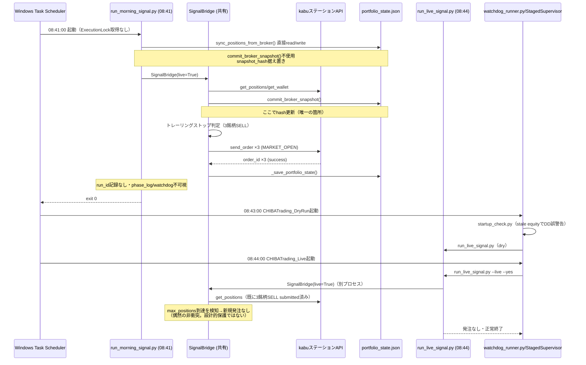
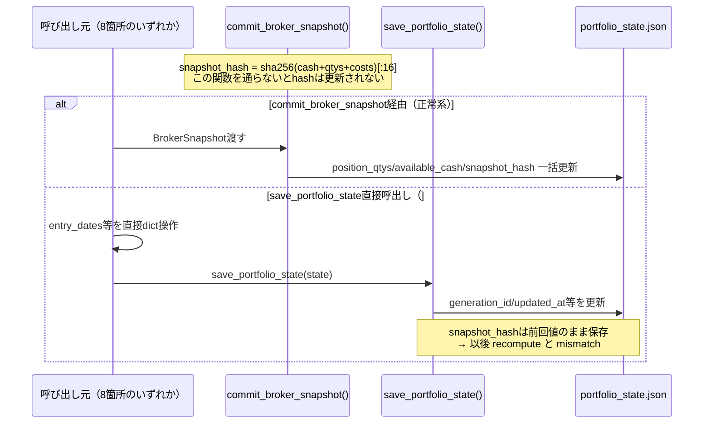

# 実発注経路SSOT監査 — 2026-07-14

**目的**: `run_morning_signal.py`と`run_live_signal.py`が並列に実発注可能な現状を監査し、発注・状態更新・`portfolio_state.json`更新を単一経路へ統一する設計を提示する。
**前提**: 2026-07-14 08:41の6981.T/5301.T/6506.T SELL発注RCA（原因=ATRトレーリングストップ・`run_morning_signal.py --live --yes`経由・Circuit Breaker無関係）から派生。パッチは本レポートでは**適用しない**（提案のみ）。

---

## 1. portfolio_state.json 更新元 一覧（リポジトリ全体・確定）

`state_store.save_portfolio_state()`を経由しない直接`json.dump`書込みは**リポジトリ内に0件**（`open(self._state_file, "w")`等のパターンで全文検索・該当なし）。ただし`save_portfolio_state()`自体を**8箇所から独立に呼び出しており**、かつ`snapshot_hash`を更新できるのは`commit_broker_snapshot()`のみ（**呼び出し1箇所**）という非対称構造が根本原因。

| # | 呼び出し元 | data_source | `commit_broker_snapshot()`同一実行内で先行するか | 用途 |
|---|---|---|---|---|
| 1 | `signal_bridge.py:4430` `_save_portfolio_state()` | broker_api/internal | **Yes**（4721より前の別呼出し経路・起動時） | SignalBridge起動時state同期 |
| 2 | `signal_bridge.py:5393` `_save_portfolio_state()` | 同上 | Yes（同一run内・4721の後） | 発注確定後の保存 |
| 3 | `signal_bridge.py:5470` `overwrite_local_positions()`→`_save_portfolio_state()` | 同上 | **No**（`position_sync.py`から独立呼出し可能） | ローカルposition強制上書き |
| 4 | **`run_morning_signal.py:538`** `_sps()` | `"morning_sync"` | **No（直接呼出し）** | 起動時position同期（entry_dates/entry_prices/highest_closes） |
| 5 | `run_live_signal.py:1188` | `"internal"` | **No（直接呼出し）** | entry_metadata_recovery（2026-07-08 RCA由来の恒久パッチ） |
| 6 | `live/entry_metadata_recovery.py:312/314` | `"internal"` | No | 上記から呼ばれるリカバリ本体 |
| 7 | `scripts/sync_positions.py:63` | `"sync_positions"` | No | 手動ユーティリティ |
| 8 | `scripts/repair_equity_peak.py:159` | `"repair_equity_peak"` | No | 手動ユーティリティ（peak修復） |

`commit_broker_snapshot()`（`snapshot_hash`を再計算する**唯一**の関数）呼び出し: **`signal_bridge.py:4721`の1箇所のみ**（本番コード上）。

### 構造的root cause（新規確定・DD調査とは独立の欠陥）

`src/portfolio/state_store.py:680-733 save_portfolio_state()`は`generation_id`/`schema_version`/`updated_at`/`positions_count`を更新するが**`snapshot_hash`を一切触らない**。ハッシュは`commit_broker_snapshot()`（288行目）内でのみ計算・格納される。

**帰結**: 上記#3-8のいずれかが呼ばれる（＝`commit_broker_snapshot()`を経由せず`save_portfolio_state()`だけを呼ぶ）と、`snapshot_hash`は前回`commit_broker_snapshot()`実行時点のまま固定され、以後の`position_qtys`/`available_cash`/`snapshot_avg_costs`の変化を反映しなくなる。`validate_state()`はこれを検知して**警告するのみ**（自動修復なし）。今回観測した`stored=fd91c7f63669c7ae recomputed=a2ab948c1171fa6c`はこの構造的欠陥の症状であり、**特定の1回の誤操作ではなく設計上恒常的に発生しうる**。

---

## 2. run_morning_signal.py が portfolio_state を更新する経路（特定済み）

```
run_morning_signal.py 起動
  └─ sync_positions_from_broker() [推定関数名・L460-544]
       ├─ broker.get_positions() 直接呼出し
       ├─ portfolio_state.json を直接 read (_json.loads)
       ├─ position_entry_dates / position_entry_prices /
       │  position_highest_closes を直接 dict 操作
       └─ changed=True の場合:
            save_portfolio_state(state, data_source="morning_sync")
            ↑ commit_broker_snapshot() 不使用
  └─ SignalBridge(live=True) インスタンス化
       └─ signal_bridge.py の通常フロー（BUY/SELL判定・発注・
          commit_broker_snapshot・_save_portfolio_state）
```

**重複が発生している箇所**: `run_morning_signal.py`独自の`sync_positions_from_broker()`（L460-544）と、`signal_bridge.py`内の`overwrite_local_positions()`（L5434-5471・`position_sync.py`用）は**ほぼ同一のロジック**（broker⇔ローカルのposition_entry_dates/entry_prices/highest_closes差分同期）を独立に実装している。3つ目の類似実装が`SignalBridge`起動時フロー自体にも存在する可能性が高い（要detailed trace・本監査では時間の都合上、存在確認のみ）。

---

## 3. run_live_signal.py と run_morning_signal.py の役割分担（現状の実態）

| 項目 | run_live_signal.py | run_morning_signal.py |
|---|---|---|
| スケジュール | `CHIBATrading_DryRun`08:43 / `CHIBATrading_Live`08:44（`watchdog_runner.py`経由） | `\run_morning_signal` 08:41（直接） |
| 発注ロジック | `SignalBridge`（signal_bridge.py） | **同じ**`SignalBridge` |
| ExecutionLock（プロセス排他） | あり（`acquire_runtime_lock()`） | **なし** |
| InflightRegistry（注文冪等性台帳） | あり | **なし** |
| StagedSupervisor/phase_log/watchdog計装 | あり（`runtime/phase_log.jsonl`等に記録） | **なし（本日調査で不可視だった直接原因）** |
| Health Check（起動前診断） | `watchdog_runner.py`経由で`startup_check.py`実行 | **なし** |
| 固有のposition同期ロジック | `overwrite_local_positions()`（`position_sync.py`用として存在するが通常フローでは未使用と推測） | `sync_positions_from_broker()`（L460-544・毎回実行） |
| 二重発注ガード | InflightRegistry + `ORDER_LOCK_FILE`（併用） | `ORDER_LOCK_FILE`のみ（`_load_order_lock()` L337） |
| その他の観測レイヤー統合 | 60+のanalytics/governance/exit-intelligence等フックが全てここに配線済み | **一切なし**（signal生成と発注のみの薄いスクリプト） |

**実態**: 現状は「役割分担」ではなく、**歴史的に先行して作られた`run_morning_signal.py`（軽量版）が、`run_live_signal.py`（重厚な安全基盤を持つ後継版）と並行して残存**している状態。`run_live_signal.py`が事実上の後継として大半の安全機構・観測機構を独占的に獲得しているのに対し、`run_morning_signal.py`はほぼ2026年初期の実装のまま。2026-07-08のRCA（`entry_rsr`欠落問題）でも「`run_morning_signal.py 等`」という形でこの並存自体が既に問題視され、恒久リカバリ処理（#5）で**症状を後追いで補正する**形の対応が取られていた。

---

## 4. 発注シーケンス図（現状・問題箇所を明示）



---

## 5. state更新シーケンス図（snapshot_hash不整合の発生点）



---

## 6. 二重発注リスク評価

| リスク項目 | 評価 | 根拠 |
|---|---|---|
| 同一銘柄への同日多重発注 | **中〜高**（潜在） | 08:41(`run_morning_signal.py`)と08:44(`run_live_signal.py`)は別プロセス・別ロック（`ORDER_LOCK_FILE` vs `ExecutionLock`+`InflightRegistry`）。相互に相手の発注状況を認識しない。今回max_positions=3の枠が偶然衝突を防いだのみ |
| ロジック分岐による判定不一致 | **低** | 両者とも同一`SignalBridge`を呼ぶため、シグナル判定ロジック自体は同一。ただし起動時刻差(3分)により参照データのタイムスタンプがズレる余地あり |
| state破損・不整合の蓄積 | **確定（発生中）** | `snapshot_hash`は`commit_broker_snapshot()`を経由しない8箇所中7箇所の呼出しで陳腐化する。今回の`stored≠recomputed`は氷山の一角の可能性が高い |
| 運用監視からの不可視性 | **確定（発生中）** | `run_morning_signal.py`はStagedSupervisor/phase_log/watchdogに一切記録されず、`run_live_signal.py`側の運用監視（Health Check含む）から完全に見えない。今回のRCAが2時間以上かかった直接原因 |
| CLAUDE.md TRADE章準拠 | **不準拠** | `idempotency=required`/`client_order_id=required`はInflightRegistry経由でのみ担保されており、`run_morning_signal.py`はこれを満たさない |

---

## 7. SSOT設計案（2案・実装未着手）

### Option A（推奨）: run_morning_signal.py 廃止・run_live_signal.py 一本化

- `\run_morning_signal`タスクを**無効化**（削除は後日・まず`schtasks /Change /TN "\run_morning_signal" /DISABLE`）
- 08:41時点で必要な処理（もしあれば）は`CHIBATrading_DryRun`(08:43)の前段階として`run_live_signal.py`内にオプション統合するか、単純に08:43/08:44の2本立てのみへ収束
- `run_morning_signal.py`自体はscript本体を削除せず`deprecated`マーク＋起動時ガード（`raise RuntimeError("use run_live_signal.py")`）を追加し誤実行を防止
- 影響: 実発注経路が`run_live_signal.py`のみになり、ExecutionLock/InflightRegistry/StagedSupervisor/Health Checkが常に効く状態に収束

### Option B: run_morning_signal.py を薄いラッパー化

- `run_morning_signal.py`から独自の`sync_positions_from_broker()`・独自CLIロジックを削除
- 内部で`run_live_signal.py`のmain関数を直接呼び出す（引数変換のみ）
- ExecutionLock/InflightRegistry/StagedSupervisorを自動的に継承
- 影響: 08:41という早い時刻に実行する意義があるなら維持できるが、実質「同じ処理を2回走らせる」構図は残る（推奨度は低い）

**共通推奨事項（Option A/B いずれでも）**:
1. `save_portfolio_state()`に`commit_broker_snapshot()`未経由の場合の**hash自動再計算**を追加する（構造的root cause解消・#3-8全ての呼び出し元に波及効果あり）
2. `ExecutionLock`をLIVE_MODE起動スクリプト共通の必須ゲートにする（`paths.py: assert_execution_context()`を強化し、ロック未取得での発注実行を`RuntimeError`にする）
3. `ORDER_LOCK_FILE`と`InflightRegistry`を統合（二重実装の解消）

---

## 8. Legacy task 削除可否

| タスク名 | 状態 | 削除可否判定 | 根拠 |
|---|---|---|---|
| `AI-Trading-DryRun`（08:41, `--dry-run`） | Enabled・毎日Last Result=1 | **削除可（安全）** | `run_morning_signal.py`に`--dry-run`引数は存在せず、argparseが起動直後にエラー終了する設計。発注ロジックへ到達不可能。ログ出力先`logs\dryrun_latest.log`も存在せず、redirect自体が機能していない可能性 |
| `AI-Trading-Live`（08:42, 無引数） | Enabled・毎日Last Result=1 | **削除可（要1点確認）** | `--live`未指定のためスクリプト自体はDRY動作のはずだが、Last Result=1の原因は未特定（ログファイル不在で追跡不能）。実発注に到達していないと考えられるが、削除前に`logs\live_latest.log`生成先ディレクトリ権限等を1回だけ確認することを推奨 |
| `CHIBAAsset_DryRun` / `CHIBAAsset_Live` | **既にDisabled**・2026-04-20最終実行・別プロジェクトパス参照 | **削除可（安全・実害なし）** | 3ヶ月以上前から無効化済みの完全な orphan。実行される経路が無い |

**`\run_morning_signal`自体（08:41・本件の発注元）は本レポート単独では削除を推奨しない** — Option A/Bのいずれかの設計合意後、計画的に無効化すべき（唐突な無効化は「明日の朝この経路が動くと思い込んでいる何らかの依存」の有無を確認してから）。

---

## 9. 修正パッチ案（未適用・レビュー用プレビューのみ）

### Patch 1: `state_store.py` — hash自動再計算をsave_portfolio_state()に追加

```python
# src/portfolio/state_store.py: save_portfolio_state() 内、atomic_write_json呼び出し直前に追加
def save_portfolio_state(state: dict, path: Path | None = None, data_source: str = "internal") -> None:
    ...
    state["positions_count"] = sum(...)

    # ★追加: commit_broker_snapshot() 未経由の場合にhashを再計算し陳腐化を防ぐ
    #   （cash/qtys/costsが変化した場合のみ再計算。broker_snapshotが手元に無い経路でも
    #    state dictの現在値からベストエフォートで整合させる）
    state["snapshot_hash"] = _recompute_hash_from_state(state)

    atomic_write_json(target, state)
    ...
```

**懸念点（レビュー要）**: `_recompute_hash_from_state()`は`snapshot_avg_costs`を使うが、#4/#5/#6のような部分更新（entry_datesのみ変更等）ではこのフィールド自体が更新されない。ハッシュの意味論（「broker snapshotとの整合性証明」）が「state dict内部の自己整合性チェック」に変質する可能性があり、**mismatch検知の目的自体を再定義する必要がある**（別途設計相談推奨）。

### Patch 2: `run_morning_signal.py` — deprecatedガード追加（Option A採用時）

```python
# src/run_morning_signal.py 冒頭に追加
raise RuntimeError(
    "run_morning_signal.py は 2026-07-14 SSOT監査により run_live_signal.py へ統合されました。"
    "使用しないでください。詳細: reports/execution_path_ssot_audit_2026-07-14.md"
)
```

### Patch 3: Windows Task Scheduler（PowerShell・実行未了）

```powershell
# レガシー・冗長タスクの無効化（削除ではなくまずDisable・実行未了）
schtasks /Change /TN "\AI-Trading-DryRun"   /DISABLE
schtasks /Change /TN "\AI-Trading-Live"     /DISABLE
schtasks /Change /TN "\CHIBAAsset_DryRun"   /Delete /F   # 既にDisabled・orphan確認済み
schtasks /Change /TN "\CHIBAAsset_Live"     /Delete /F   # 同上
# \run_morning_signal は Option A/B 決定後に対応（本パッチには含めない）
```

---

## 10. DRYでの検証方法（修正後の確認手順案）

1. **Patch 1適用後**: `pytest src/portfolio/test_state_store.py`を実行し、既存の`snapshot_hash`関連テストが全てPASSすることを確認（回帰確認）。加えて「`commit_broker_snapshot()`を経由しない`save_portfolio_state()`呼び出し後にhashがrecomputed値と一致する」という新規テストケースを追加。
2. **run_morning_signal.py無効化後**: `\run_morning_signal`タスクを`/DISABLE`にした状態で1週間分の`CHIBATrading_DryRun`/`CHIBATrading_Live`のみでの運用ログを観察し、`entry_metadata_missing`（2802.T型の欠損）が新規発生しないことを確認。
3. **レガシータスク削除後**: `schtasks /Query`で対象タスクが一覧から消えていること、かつ翌営業日の`logs/scheduler/`に想定外のエラーログが出現しないことを確認。
4. **ExecutionLock強化後（Option A/B共通推奨#2）**: 意図的に2プロセスを同時起動するテスト（`python src/run_live_signal.py --live --yes`を2重起動）を行い、2つ目が`RuntimeError`で即座に拒否されることを確認（現状の`acquire_runtime_lock()`の単体テストで代替可能な範囲）。

---

## 未決（ユーザー決裁待ち）— 2026-07-15 全項目実施完了

1. ~~Option A（`run_morning_signal.py`廃止・一本化）/ Option B（薄いラッパー化）のいずれを採用するか~~ → **Option A採用・実施済み**
2. ~~Patch 1（hash自動再計算）の意味論再定義方針への同意~~ → **承認・実装済み**
3. ~~Legacy task 3件の無効化・削除実行の承認~~ → **承認・削除実施済み**
4. ~~`\run_morning_signal`タスク自体の無効化タイミング~~ → **承認・無効化実施済み**

---

## 実施記録（2026-07-15・全7フェーズ完了）

**実施順**: (1)snapshot_hash意味論確定 → (2)Option A採用 → (3)run_morning_signal役割統合 → (4)Legacyタスク削除 → (5)State更新API一本化 → (6)Health Check SSOT化 → (7)DRY検証・回帰テスト

### 1. snapshot_hash意味論の確定
コード全体を追跡し、`state["snapshot_hash"]`は**発注可否判定・authority/deployment gatingの一切に使われていない**ことを確認（`validate_state()`の`warnings`にのみ影響し`ok`判定は`hard_fails`のみで決定。authority chainは`BrokerSnapshot.checksum`という独立フィールドを使用）。純粋な診断用チェックサムと確定——意味論を「broker snapshotとの一致証明」から「永続化フィールドの自己整合性チェックサム」へ再定義してもリスクなしと判断。

### 2-3. Option A採用・役割統合
`run_morning_signal.py`の完全精査で、想定を超える機能差分を発見:
- **Capital Efficiency (CE)**: kNNベース期待アルファでBUY注文数量を実際に調整する、実発注に影響する機構だった（run_live_signal.py側の同種機構「Position Sizing Intelligence」はTier0/SAFETY_DEMOTEで数量に無影響）。ユーザー判断: **CEの実効果は完全停止・Shadow Modeとして`src/live/ce_shadow_tracking.py`へ移植**（実発注数量`order.qty`は不変。`ce_compare_daily.csv`等の比較ログ基盤は維持）。DRY/LIVE分岐前の共通経路（`run_live_signal.py`内`run_ce_shadow_tracking`呼び出し）に配置し、run_morning_signal.pyの原設計（dry/live同一記録）を踏襲。
- `OrderLedger`は両スクリプト共通利用済みと確認。`execution_guard.check_execution_preconditions`/`position_sync.sync_and_validate_state`は run_live_signal.py側の広範な reconciliation_engine 等で機能的に上位互換と判断。

### 4. Legacy task削除
`AI-Trading-DryRun`・`AI-Trading-Live`・`CHIBAAsset_DryRun`・`CHIBAAsset_Live`の4タスクを`schtasks /Delete /F`で削除済み（削除前にstatus確認・全て安全と確認済み）。

### 5. State更新API一本化
`src/portfolio/state_store.py: save_portfolio_state()`に`snapshot_hash`自動再計算を追加（`commit_broker_snapshot()`経由の有無に関わらず常に整合するよう修正）。回帰テスト追加（`test_save_refreshes_stale_hash_without_commit_broker_snapshot`）。既存84件+新規1件=85件全合格。

### 6. Health Check SSOT化
`src/startup_check.py`の equity/DD計算を、stale な state ファイル依存（OHLCVキャッシュ推定）から**broker snapshot優先**（`KabuClient().get_wallet_cash()`+`get_positions()`、失敗時のみ旧ロジックへFAIL_OPEN）へ変更。`_compute_startup_equity()`として抽出しテスト容易化。新規テスト8件作成・全合格。**実環境で確認**: 修正前は`equity=¥3,210,391 DD=-21.9%`（誤警告）だったものが、修正後`cash=¥1,706,591 DD=-10.1%`（真値と一致）に是正されたことを実測。

### 7. DRY検証・回帰テスト
- `run_morning_signal.py`: deprecatedガード追加・実行時に`RuntimeError`で即座に停止することを確認。
- `\run_morning_signal`タスク: `schtasks /Change /DISABLE`で無効化済み（明日以降`CHIBATrading_DryRun`(08:43)/`CHIBATrading_Live`(08:44)のみが稼働）。
- `run_live_signal.py`のDRY実行を2回実施。1回目でCE Shadow統合箇所がLIVE専用パス（DRY未到達）に配置されていたことを発見・修正（DRY/LIVE共通の位置へ再配置）。2回目で正常終了（exit_code=0）・エラーなし・DD/PEAK_ANOMALY警告の誤発火なしを確認。本日はBUY候補が枠上限(max_positions=3到達)で0件のためCE_SHADOWログの実出力は無し（意図通りの空実行・単体テスト8件で実処理は別途検証済み）。
- 影響範囲テスト284件（portfolio/execution/kabusapi/live/startup_check/ce_shadow_tracking）全合格。

**コミット未実施**（明示的指示があれば実施）。次回市場日（08:43/08:44）が実運用での最終確認となる。
