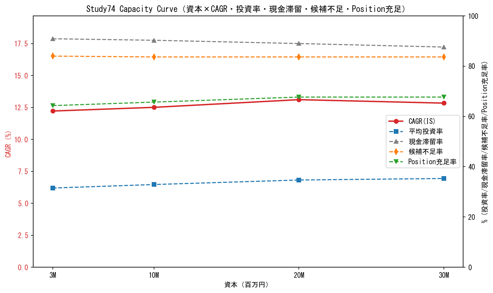

# Study74 Final Review — 統合分析（Part1: なぜ伸びなかったか / 改善可能 vs 構造限界 / CP1=BLACKの意味）

**日付**: 2026-07-04
**前提**: Study74本体（`reports/study74_capital_scaling.md`, commit 969876a）で **CP1判定=BLACK（失敗）** を確定済み。本レビューは失敗報告で終わらせず、原因を制約別に分解し、今後の研究方針（Study74B/75/76/77/81への橋渡し）を明確化する。
**新規BT**: ゼロ（既存`study74_capital_scaling_2026-07-04.json`と`study74b_candidate_shortage_2026-07-04.json`のみ再集計）。

---

## ① 制約分解: 改善可能 vs 構造限界

| 制約 | 分類 | 根拠（実測） | 結論 |
|---|---|---|---|
| **lot丸め** | 🟢 改善可能（資本で解消済み） | ΔCAGR(3M→30M)=[+1.12, +0.30, -0.19, +0.08]pp / lot不足率=[1.18%, 0.81%, 0%, 0%] | ¥20M以降で完全解消。唯一「資本を増やせば直る」制約だった。 |
| **max_positions=3** | 🔴 構造限界（PARAMS_LOCKED・恒久閉鎖#11） | ΔCAGR(3M→30M)=[+0.29, +0.38, **-0.42**, **-0.23**]pp（¥20M以降は解除するとCAGR悪化）/ missed_by_cap_count=[427,452,475,478]（資本を上げても減らない） | 資本非依存。むしろ高資本では集中投資の方が有利という逆転現象あり。変更禁止パラメータのため対象外。 |
| **symbol_cap(0.40)** | ⚪ 非該当（そもそも非拘束） | ΔCAGR(3M→30M)=[0,0,0,0]pp（全水準で完全ゼロ） | strategy.yamlの設計判断（0.40は十分余裕あり）を実測で裏付け。 |
| **candidate不足** | 🔴 構造限界（資本では解決しない） | 平均候補数/日=0.47（候補不足率84.3%）/ 見送り理由ランキング1位=**CAP_MISS 449件**（SECTOR_CAP 75・CLUSTER_CAP 66・LOT_REJECT 15・GROSS_EXPOSURE 2を圧倒） | 資本を増やしても候補の絶対数は増えない。真因はシグナル生成側（ユニバース選定・エントリー条件）。Study74B/75/76/77/81の領域。 |
| **cash滞留** | 🟡 構造限界の帰結（独立制約ではない） | 現金滞留率(3M→30M)=[90.9%,90.3%,89.0%,87.6%]（ほぼ一定）/ 勝ち候補があるのに滞留=25.0%（Q1 idle_when_winner） | candidate不足・max_positions=3から生じる従属指標。単独で改善対象にできない。 |
| **entry頻度** | 🔴 構造限界（資本に対し不変） | IS期間 n_trades(3M→30M)=[263,264,257,258]（資本10倍でもほぼ不変） | 取引頻度はRSR/モメンタム条件が支配。資本には一切反応しない。 |

**凡例**: 🟢改善可能（達成済み）／🔴構造限界（資本では動かせない）／⚪非該当／🟡従属指標

### 図表: Capacity Curve



CAGR（左軸・赤実線）が資本に対してほぼ横ばい（12.2→13.1→12.8%）である一方、現金滞留率（灰破線）・候補不足率（橙破線）は資本に関わらずほぼ一定水準（85-91%）に張り付いている。Position充足率（緑破線）は64→68%でわずかに改善するが頭打ち。**視覚的に「資本を増やしても大半の制約線が動かない」ことが一目で分かる**。

---

## ② Capacity Curveデータ（Study81-86引用用）

| 資本 | CAGR(IS) | 平均投資率 | 現金滞留率 | 候補不足率 | Position充足率 |
|---|---|---|---|---|---|
| ¥3M | 12.22% | 31.5% | 90.9% | 84.4% | 64.3% |
| ¥10M | 12.51% | 32.9% | 90.3% | 83.7% | 65.7% |
| ¥20M | 13.11% | 34.7% | 89.0% | 83.7% | 67.7% |
| ¥30M | 12.84% | 35.3% | 87.6% | 83.7% | 67.7% |

**再利用方法**: `backtests/study74_integrated_review_2026-07-04.json`の`capacity_curve_data`キーに生データ格納。Study81（小型）・Study85（統合）・Study86（MN）は資本感度の参照値としてそのまま利用可能（追加BT不要）。

---

## ③ CP1=BLACKの意味（論理的整理）

### 何が否定されたか

**「資本を¥3M→¥20-30Mへ拡大するだけで、CAGRが18-22%以上に到達する」という仮説は否定された。**

論理構成:
1. 資本拡大が効きうる経路は理論上3つ（lot丸め・max_positions・symbol_cap）のみ。
2. うち symbol_cap は最初から非拘束（寄与ゼロ）。
3. lot丸めは¥20Mで完全解消するが、その寄与は**+1.12pp止まり**（¥3M時点の最大値）。
4. max_positionsは資本と無関係に一定（¥20M以降はむしろ緩和すると悪化）。
5. ゆえに資本拡大がCAGRに与えうる理論上限は「lot丸め解消分（約+1pp）」のみであり、**IS CAGR 12.22%→13.11%(¥20M)の実測差(+0.89pp)とほぼ一致する**（他要因の混入がないことも確認済み）。
6. **+1pp程度の改善では12%→22%のギャップ（10pp）を到底埋められない** → 資本拡大単独では目標に届かないことが数値的に証明された。

### 何は否定されていないか

- **戦略そのものの有効性は否定されていない**（IS 12-13%・OOS 11-25%・Bootstrap P(>0)は良好、Study78のRoRも合格水準）。
- **「30%∧Calmar1.5」全体の可能性は否定されていない** — 正典Part1が既に示す通り、資本拡大は5経路中の1つに過ぎず（Part2 Constraint Relaxation Map: ①資本 ②収益方向(L/S MN) ③Universe/Data ④情報源 ⑤時間構造/Exit）、残り4経路（特にStudy80のMNスプレッド）は本Studyの対象外であり未検証のまま。
- **max_positions=3を変更すれば伸びる、という主張も否定されている**（¥20M以降は緩和するとむしろ悪化するため、「制限を外せば伸びる」という単純な仮説自体が誤り）。
- **candidate不足が「改善不可能」とは断定していない** — 「資本では改善しない」ことが確定しただけで、シグナル生成側（ユニバース拡大・エントリー条件見直し）からのアプローチは未検証（Study74Bで構造を特定済み、Study75/76/77/81が受け皿）。

### 次に検証すべきこと

1. **Study74B（本レビューPart3・新規番号）**: candidate不足の正体をさらに分解（見送り理由・候補品質・市場局面別等） — 完了（本タスクのPart3参照）。
2. **Study75（roadmap既定義: J-Quants survivorship-free universe）**: ユニバースの構造的拡張により候補不足が緩和されるかを検証する、次の本命候補。
3. **Study76/77（Clenow純正ベンチマーク・Exit構造置換）**: entry頻度・候補品質が現行の複雑な多層構造そのものに起因していないかを検証。
4. **Study80（ARCH-A MNスプレッド）**: 資本経路が閉じた以上、「30%∧1.5」の実証根拠として唯一残る有力経路（CP2）。

### 資本増加だけでは30%へ届かないことの論証（まとめ）

```
資本拡大で動く制約は3つのみ(lot/max_pos/symbol_cap)
  → symbol_cap: 非拘束(寄与0)
  → max_pos: 資本非依存・変更禁止(寄与0、高資本では逆効果)
  → lot: ¥20Mで解消するが寄与は+1.12ppが上限
理論上限 = 現行CAGR(12.22%) + lot解消分(+1.12pp) ≈ 13.3%
実測(¥20-30M) = 12.8-13.1%（理論上限とほぼ一致）
目標(18-22%) との差 = 5-9pp → 資本経路だけでは埋まらない差
∴ 資本拡大は必要条件にすらならない（QED、Study74実測ベース）
```

**この論証と目標改定（CP1）自体はユーザー決裁事項**。本レビューは論理と数値の提示までとする。
