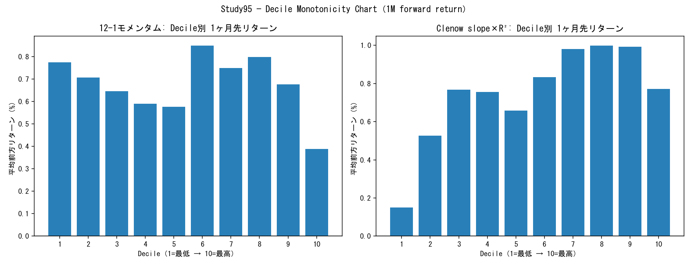

# Study95 — Cross-Sectional Momentum Factor-Level Ground Truth（2026-07-14）

正典: `reports/fujiko_r2_research_roadmap.md` v2 Part5 Study95仕様（H0・最優先）。
禁止事項（フジコ法ロジック/RSR/percentile型トレーディングパラメータ/BTエンジン）は全て不使用（decile分解は本タスク仕様が明示的に要求する記述統計手法であり、選定ルールではない）。

データ: Universe C（Study75A）119ヶ月・パネル行数=108,895・価格ファイル欠落=0銘柄

## サマリー判定

- **12-1モメンタム: FAIL_ZERO_SPREAD**（12M年率スプレッド=-1.83%・NW-t=-0.368・正のhorizon数=0/4）
  - 推奨: Candidate A-E全凍結。旧正典ARCH系（PEAD/TSMOM）への転進をユーザーへ提起。
- **Clenow slope×R²: FAIL_ZERO_SPREAD**（12M年率スプレッド=-1.79%・NW-t=-0.669・正のhorizon数=3/4）
  - 推奨: Candidate A-E全凍結。旧正典ARCH系（PEAD/TSMOM）への転進をユーザーへ提起。

判定基準（タスク仕様）: SUCCESS=Q10-Q1年率>+5%∧|t|>2∧複数期間一貫 / FAIL=spread≈0・逆転・不安定 / KILL=CS momentum否定→FUJIKO-R2停止→PEAD/TSMOM再検討

## 12-1モメンタム

### Decile Table（平均前方リターン・%）

| Decile | 1M | 3M | 6M | 12M | N(1M) |
|---|---|---|---|---|---|
| 1 | 0.78% | 1.74% | 3.49% | 5.99% | 9660 |
| 2 | 0.71% | 1.80% | 3.64% | 7.47% | 9613 |
| 3 | 0.65% | 2.13% | 4.05% | 8.02% | 9601 |
| 4 | 0.59% | 1.87% | 3.61% | 7.66% | 9609 |
| 5 | 0.58% | 1.88% | 3.55% | 7.17% | 9613 |
| 6 | 0.85% | 2.07% | 3.43% | 6.36% | 9577 |
| 7 | 0.75% | 2.05% | 3.37% | 7.10% | 9580 |
| 8 | 0.80% | 2.26% | 3.54% | 6.85% | 9593 |
| 9 | 0.68% | 2.10% | 3.53% | 6.78% | 9569 |
| 10 | 0.39% | 0.63% | 0.28% | 3.07% | 9624 |

### Q10-Q1 Spread（年率・Newey-West t・Bootstrap 95%CI）

| Horizon | N期間 | 平均spread(生) | 年率spread | NW-t | Bootstrap 95%CI(年率) |
|---|---|---|---|---|---|
| 1M | 107 | -0.39% | -4.60% | -0.699 | [-16.50%, 8.51%] |
| 3M | 105 | -0.99% | -3.90% | -0.762 | [-13.99%, 5.68%] |
| 6M | 101 | -2.79% | -5.50% | -1.101 | [-15.00%, 4.18%] |
| 12M | 95 | -1.83% | -1.83% | -0.368 | [-10.60%, 8.87%] |

### Information Coefficient

| Horizon | mean IC | std IC | t-stat | hit rate | N期間 |
|---|---|---|---|---|---|
| 1M | -0.024 | 0.141 | -1.788 | 40.19% | 107 |
| 3M | -0.037 | 0.136 | -2.768 | 37.14% | 105 |
| 6M | -0.048 | 0.139 | -3.457 | 34.65% | 101 |
| 12M | -0.044 | 0.152 | -2.825 | 52.63% | 95 |

### Monotonicity（Spearman: decile順位 vs 平均リターン）

| Horizon | Spearman ρ | p値 | 隣接decile逆転数(/9) |
|---|---|---|---|
| 1M | -0.152 | 0.676 | 7/9 |
| 3M | 0.236 | 0.511 | 4/9 |
| 6M | -0.588 | 0.074 | 6/9 |
| 12M | -0.455 | 0.187 | 6/9 |

### Regime分解（TOPIX>MA200・12M horizon年率spread）

| Regime | N期間 | 年率spread | NW-t |
|---|---|---|---|
| bull | 61 | -1.94% | -0.404 |
| bear | 34 | -1.63% | -0.517 |

### Sector Neutral（TOPIX17内demean後・Q10-Q1 spread）

| Horizon | N期間 | 年率spread(sector-neutral) | NW-t |
|---|---|---|---|
| 1M | 107 | -1.60% | -0.268 |
| 3M | 105 | -2.59% | -0.605 |
| 6M | 101 | -4.24% | -1.101 |
| 12M | 95 | -2.16% | -0.564 |

### 容量診断（ADV20・Q10 turnover）

- Q1(最低decile) ADV20: median=¥886,299,510
- Q10(最高decile) ADV20: median=¥927,409,528
- Q10月次turnover: mean=34.55% median=34.55%

### Factor Persistence（rank自己相関）

| Lag | mean rank autocorr | N期間 |
|---|---|---|
| 1M | 0.886 | 107 |
| 3M | 0.706 | 105 |
| 6M | 0.443 | 102 |
| 12M | -0.006 | 96 |

## Clenow slope×R²

### Decile Table（平均前方リターン・%）

| Decile | 1M | 3M | 6M | 12M | N(1M) |
|---|---|---|---|---|---|
| 1 | 0.15% | 0.32% | 1.26% | 6.45% | 10499 |
| 2 | 0.53% | 1.37% | 3.60% | 8.15% | 10446 |
| 3 | 0.77% | 2.01% | 3.91% | 8.37% | 10432 |
| 4 | 0.76% | 1.95% | 3.86% | 8.35% | 10434 |
| 5 | 0.66% | 2.25% | 4.37% | 8.03% | 10453 |
| 6 | 0.83% | 2.22% | 4.25% | 8.21% | 10410 |
| 7 | 0.98% | 2.48% | 4.62% | 7.23% | 10427 |
| 8 | 1.00% | 2.91% | 4.80% | 7.71% | 10442 |
| 9 | 0.99% | 2.68% | 4.80% | 7.29% | 10432 |
| 10 | 0.77% | 1.98% | 3.09% | 3.96% | 10466 |

### Q10-Q1 Spread（年率・Newey-West t・Bootstrap 95%CI）

| Horizon | N期間 | 平均spread(生) | 年率spread | NW-t | Bootstrap 95%CI(年率) |
|---|---|---|---|---|---|
| 1M | 115 | 0.57% | 7.02% | 1.110 | [-5.59%, 20.55%] |
| 3M | 113 | 1.65% | 6.77% | 1.739 | [-0.79%, 14.91%] |
| 6M | 109 | 1.89% | 3.83% | 1.289 | [-2.68%, 7.56%] |
| 12M | 103 | -1.79% | -1.79% | -0.669 | [-6.04%, 3.03%] |

### Information Coefficient

| Horizon | mean IC | std IC | t-stat | hit rate | N期間 |
|---|---|---|---|---|---|
| 1M | -0.003 | 0.139 | -0.196 | 42.61% | 115 |
| 3M | 0.001 | 0.118 | 0.129 | 43.36% | 113 |
| 6M | -0.006 | 0.103 | -0.636 | 44.04% | 109 |
| 12M | -0.037 | 0.122 | -3.053 | 44.66% | 103 |

### Monotonicity（Spearman: decile順位 vs 平均リターン）

| Horizon | Spearman ρ | p値 | 隣接decile逆転数(/9) |
|---|---|---|---|
| 1M | 0.818 | 0.004 | 4/9 |
| 3M | 0.697 | 0.025 | 4/9 |
| 6M | 0.539 | 0.108 | 3/9 |
| 12M | -0.430 | 0.214 | 5/9 |

### Regime分解（TOPIX>MA200・12M horizon年率spread）

| Regime | N期間 | 年率spread | NW-t |
|---|---|---|---|
| bull | 63 | -0.31% | -0.136 |
| bear | 34 | -7.64% | -2.681 |

### Sector Neutral（TOPIX17内demean後・Q10-Q1 spread）

| Horizon | N期間 | 年率spread(sector-neutral) | NW-t |
|---|---|---|---|
| 1M | 115 | 4.80% | 0.862 |
| 3M | 113 | 6.44% | 1.999 |
| 6M | 109 | 4.25% | 1.569 |
| 12M | 103 | -1.24% | -0.476 |

### 容量診断（ADV20・Q10 turnover）

- Q1(最低decile) ADV20: median=¥906,862,581
- Q10(最高decile) ADV20: median=¥931,318,676
- Q10月次turnover: mean=49.62% median=50.00%

### Factor Persistence（rank自己相関）

| Lag | mean rank autocorr | N期間 |
|---|---|---|
| 1M | 0.792 | 115 |
| 3M | 0.150 | 113 |
| 6M | 0.017 | 110 |
| 12M | -0.025 | 104 |

## Sector別 IC（TOPIX17・1M horizon・N<30は insufficient_n）

| Sector17 | mom IC | mom N | Clenow IC | Clenow N |
|---|---|---|---|---|
| その他 | 0.181 | 2318 | 0.122 | 2461 |
| エネルギー資源 | -0.049 | 653 | 0.042 | 693 |
| 不動産 | -0.081 | 2472 | -0.023 | 2665 |
| 医薬品 | -0.064 | 3206 | -0.042 | 3476 |
| 商社・卸売 | -0.052 | 4079 | -0.034 | 4365 |
| 小売 | -0.091 | 7021 | -0.062 | 7495 |
| 建設・資材 | -0.043 | 5768 | -0.023 | 6210 |
| 情報通信・サービスその他 | -0.056 | 18912 | -0.033 | 20893 |
| 機械 | -0.059 | 5904 | -0.009 | 6374 |
| 素材・化学 | -0.036 | 7310 | -0.027 | 7860 |
| 自動車・輸送機 | -0.040 | 3068 | -0.019 | 3319 |
| 運輸・物流 | -0.033 | 3599 | -0.049 | 3860 |
| 金融（除く銀行） | -0.060 | 3362 | -0.065 | 3662 |
| 鉄鋼・非鉄 | -0.025 | 2593 | -0.026 | 2785 |
| 銀行 | 0.137 | 3050 | 0.046 | 3316 |
| 電機・精密 | -0.049 | 9762 | -0.005 | 10541 |
| 電気・ガス | -0.044 | 1674 | 0.010 | 1801 |
| 食品 | -0.061 | 3862 | -0.067 | 4173 |

## 結論

- 仮説1（Cross-sectional momentum有効性）: **FAIL_ZERO_SPREAD**（主判定=12-1モメンタム。Clenow slope×R²は補助判定=**FAIL_ZERO_SPREAD**）
- Kill基準発動: **True**
- 次アクション: Candidate A-E全凍結。旧正典ARCH系（PEAD/TSMOM）への転進をユーザーへ提起。

---

*生成: Study95自動分析パイプライン, 2026-07-14。新規BT実行なし（BTエンジン不使用・純粋クロスセクション統計）。fresh_run_required準拠（本分析自体が初回実行・キャッシュ値不使用）。*