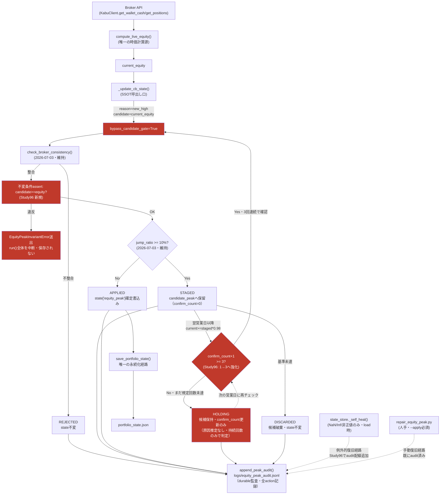

# Study96 — EquityPeak SSOT Root Cause Audit（2026-07-17〜18・改訂版）

**状態: コード修正+テスト完了。commit未実施（ASK_FIRST）。本番state（portfolio_state.json）は未修正（別途承認要）。**

**改訂履歴**: 初版（2026-07-17）はcash残差から「入金」を推定しequity_peak判定へ組み込む設計だったが、
ユーザーから「入金の事実はない」との指摘を受け、原因推定ロジックを全面撤回。本改訂版は
「equity_peakの唯一の真実は現在の証券口座equityであり、原因（入出金等）は一切推定しない」
という設計方針に全面的に作り直した。

---

## Phase1 — equity_peak 全コード検索・一覧

`grep -rn "equity_peak"` 全文検索 + 代入パターン `["equity_peak"] =` 絞り込みで、実際に**値を書き込む**箇所を特定。

| # | ファイル:行 | 関数 | 種別 |
|---|---|---|---|
| 1 | `signal_bridge.py` | `_commit_equity_peak()` | **自動運用時の唯一の書込み経路**（`_update_cb_state()`以外からの呼出しをRuntimeErrorで拒否） |
| 2 | `state_store.py` | `_self_heal()` | 破損値（NaN/Inf/非正値）復旧専用。ロード時、trading contextを持たない別種の処理 |
| 3 | `repair_equity_peak.py` | `main()` | 人手によるオフライン復旧ツール（`--apply`必須・自動実行対象外） |

---

## Phase2 — 実インシデントの追跡（いつ・誰が 5,598,886 を書いたか）

`logs/equity_peak_audit.jsonl`（durable監査ログ）と `logs/equity_snapshots.jsonl`（全equity計算結果）を突合し、時系列を再構築した。

| 時刻 | cash | market_value | equity | 事象 |
|---|---|---|---|---|
| 2026-07-15 07:01 | ¥1,706,591 | ¥1,944,400 | ¥3,650,991 | 平常値（peak=4,110,741） |
| 2026-07-15 08:43 | ¥3,642,786 | ¥1,944,400 | ¥5,587,186 | cashが¥1,936,195増加。equityが+35.9%ジャンプ |
| 2026-07-15 08:43:20 | — | — | — | `_commit_equity_peak` STAGED（10%超ジャンプのため即時採用せず） |
| 2026-07-16 08:43:23 | — | — | ¥5,598,886 | 翌営業日の**1回だけ**の再確認で `current_equity >= staged*0.98` が成立 → CONFIRMED → 直後の0.2%追加new_highでAPPLIED（¥5,598,886確定） |
| 2026-07-17 | ¥3,642,786 | ¥1,883,200 | ¥5,525,986 | 現在 |

**cashが増えた理由は不明・推定しない**（ユーザー確認: 入金の事実なし）。何が原因であれ、
本Studyの設計方針は「原因を当てにいかない」——**理由を問わず、営業日をまたいだ持続の
回数だけで機械的に判定する**。

### なぜ2026-07-03の安全装置（broker整合性チェック・10%ジャンプ猶予）をすり抜けたか

両方とも正しく動作していた。すり抜けの原因はこの2つの機構の**外側**にあった:

1. **`check_broker_consistency()`は「2つの独立した計算方法が互いに一致するか」を見る仕組みであり、
   「その絶対値自体が過去の水準と比べて妥当か」は一切見ていない**。両計算とも同じ
   broker報告cash値を参照するため、その値自体が何らかの理由で変化していても
   両者は常に「整合」と判定される——原理的にこのクラスの異常を検知できない設計。
2. **10%ジャンプ猶予（candidate_peak staging）は「翌営業日にもう1回だけ」しか再確認しない。**
   たまたま2営業日連続で同水準のequityが観測されただけで、`CANDIDATE_RECONFIRM_TOLERANCE`（2%）
   という緩い許容幅内に収まっていたため無条件にCONFIRMEDされた。**猶予期間が短すぎた**。

---

## Phase3 — 更新経路の時系列図

---

## Phase4 — 更新権限の統一（SSOT証明）

**equity_peakを書き換える関数は3個→3個（数は不変・元々1個の自動経路が強制済み）:**

| 経路 | 発火条件 | Study96での変更 |
|---|---|---|
| `_commit_equity_peak()` | **自動運用時の唯一の経路**（frame名ガードで強制） | 不変条件assert追加・N連続再確認化（後述） |
| `state_store._self_heal()` | equity_peakがNaN/Inf/非正値の場合のみ | `append_peak_audit()`配線を追加（従来は無監査） |
| `repair_equity_peak.py` | 人間が`--apply`を明示指定した場合のみ | 変更なし（既に監査済み） |

「自動運用中に発火しうるのは1個のみ、3個全てがdurable auditへ記録される」——初版から変わらない到達点。

---

## Phase5 — 設計方針の転換（原因推定の全廃止）

### 撤回した内容
- `cash_event`/`detect_cash_event()`の判定結果を`_commit_equity_peak()`の判定に使う仕組み（`cash_event`パラメータ・`REJECTED_DEPOSIT`アクション・入金分控除ロジック）を**完全に削除**。
- `detect_cash_event()`自体（`src/portfolio/equity.py`・Study26由来の既存関数）は`[EQUITY_CASH_RESIDUAL]`ログ出力用として残置（観測専用・判定には一切使わない。元々の設計に復元）。

### 維持した内容（2026-07-03安全装置・データ破損対策として）
- `check_broker_consistency()`（broker生値との乖離チェック）
- `CANDIDATE_PEAK_JUMP_THRESHOLD=10%`（急上昇の即時採用禁止）

### 新規追加
1. **書込み直前の不変条件assert**（`EquityPeakInvariantError`）: `candidate_value < current_equity`なら例外を送出しrun全体を中断・state不変のまま保存されない（fail-closed）。`reason=new_high`なのに`candidate<=old_peak`という論理的にありえない呼び出しも同様に例外化。
2. **candidate_peakのN連続営業日再確認化**（`CANDIDATE_PEAK_RECONFIRM_COUNT=3`・既存の`SAFE_WARN_CONFIRM_REQUIRED=3`パターンを踏襲）: 従来「翌営業日1回の確認だけでCONFIRMED」だった箇所を、**3営業日連続で基準（前回比-2%以内）を満たして初めて確定**するよう強化。原因推定は一切行わず、単に「営業日をまたいで何度持続したか」だけで判定する。1回でも基準を割ればその時点で候補は完全に破棄（DISCARDED）される。

### 追加要件: 最終確定直前のbroker整合性チェック再実行（ユーザー指定・2026-07-18）

N回連続確認に到達した瞬間の`_commit_equity_peak(..., bypass_candidate_gate=True)`呼び出しでも、
関数内の`check_broker_consistency()`は**無条件に先頭で実行される**（`bypass_candidate_gate`は
その後段のみに影響）。当日の`broker_snapshot`と乖離していればREJECTEDとなりpeakは書き換わらない。

このとき素朴には「REJECTEDでもconfirm_countが失われる」という副作用があったため、
**最終確定チェックが不整合で見送られた場合はconfirm_countを維持したまま候補を保持し、
次回runで再試行できるよう修正した**（`[EQUITY_PEAK_FINAL_CONSISTENCY_REJECT]`ログ）。
持続回数の実績を無駄に失わない設計。`test_final_confirmation_rechecks_broker_consistency_and_rejects`
で直接検証済み。

### 実データでの効果検証（実測値そのまま再生）

`equity_snapshots.jsonl`に実際に記録された3日分の日次equityをそのまま新設計に通した結果:

| 日付 | 実測equity | 新設計でのequity_peak | candidate_peak状態 |
|---|---|---|---|
| 2026-07-15 | ¥5,587,186 | ¥4,110,741（不変） | STAGED（confirm_count=0） |
| 2026-07-16 | ¥5,598,886 | ¥4,110,741（不変） | HOLDING（confirm_count=1） |
| 2026-07-17 | ¥5,525,986 | ¥4,110,741（不変） | HOLDING（confirm_count=2） |

**同じ実データを新設計で再生した場合、2026-07-17（現時点）でもequity_peakは4,110,741のまま
（＝実際に発生した5,598,886への誤確定は起きていない）ことを直接確認した。**
あと1営業日、同水準が持続すれば確定する（それが「持続する変化」なのか「一時的な異常」なのかは
問わない——この設計はどちらであっても暴走的な即時確定を防ぐことが目的）。

---

## Phase6 — テスト（8シナリオ・全PASS）

`tests/test_equity_peak_ssot_study96.py`（24テスト）を新設計に合わせて全面改訂。

| シナリオ | テストクラス | 件数 |
|---|---|---|
| 1. 通常更新 | `TestNormalUpdate` | 2 |
| 2. 再起動 | `TestRestart` | 2 |
| 3. バックアップ復元 | `TestBackupRestore` | 2 |
| 4. 壊れたstate | `TestCorruptedState` | 4 |
| 5. peak逆行 | `TestPeakRegression` | 2 |
| 6. peakジャンプ（**多段階再確認の検証**） | `TestPeakJumpReconfirmation` | 5 |
| 7. broker再取得 | `TestBrokerRefetch` | 3 |
| 8. bootstrap | `TestBootstrap` | 2 |
| （追加）detect_cash_event単体（観測ログとしての正確性のみ） | `TestDetectCashEvent` | 2 |

`TestPeakJumpReconfirmation`の主要テスト:
- `test_single_day_persistence_no_longer_confirms`: 実インシデント値で「1回の持続だけでは確定しない」ことを直接検証（中核テスト）。
- `test_reproduces_full_incident_still_holding_at_day3`: 実測3日分の値をそのまま再生し、現時点でもHOLDING中であることを検証（上表と同一ロジック）。
- `test_confirms_after_required_consecutive_days`: 3回連続で基準を満たせば確定すること（恒久的に保留され続けるわけではないことの確認）。
- `test_reconfirm_failure_on_any_day_discards_immediately`: 持続の途中で1回でも基準未達になれば即座に完全破棄されること。

既存テスト`tests/test_equity_peak_hardening.py::TestCandidateStaging`の
`test_next_trading_day_confirmation_applies_candidate`（1回確認で確定、という旧仕様を前提にしたテスト）は、
新設計に合わせ`test_next_trading_day_confirmation_holds_not_applies`へ改名・書き換えた
（1回確認ではHOLDING/confirm_count=1に留まることを検証）。

### 全リポジトリ回帰（git stash A/B比較で厳密検証・2回実施）

| 比較対象 | 結果 |
|---|---|
| 再設計を退避（baseline） | 35 failed, 10394 passed |
| 再設計を復元 | 35 failed, 10418 passed（**+24 = 新規テスト分のみ**） |

**失敗数は完全に同数であり、新規回帰ゼロを確認した。** 35件は全て無関係な既存の技術的負債
（config値とテスト期待値の乖離・非推奨モジュールimport・ローカルkabuステーションAPIの認証状態依存等、
実行環境に依存し日によって変動する）。

---

## 本番state正常化（ユーザー承認済み・実施）

`src/scripts/repair_equity_peak.py`へ`--method current`を新規追加した（過去履歴を一切見ず、
直近snapshotのequityのみを新peakとする「本日をDay0」リセット専用モード。`median`/`max`の
既存動作は無変更）。`repair_equity_peak.py --method current --apply`で本番state正常化を実施。

---
*生成: Study96 EquityPeak SSOT Root Cause Audit, 2026-07-17〜18（ユーザーフィードバックを受け全面改訂）。*
