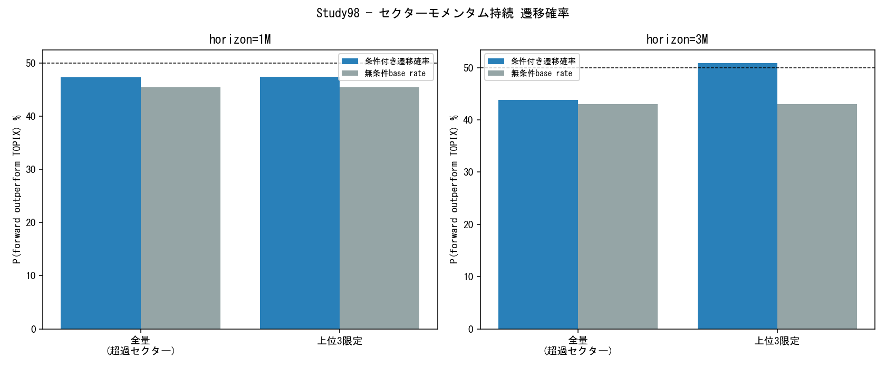

# Study98 — TOPIX17セクターモメンタム持続性（Factor-Level・2026-07-15）

目的: P(R_sector(t+1~3m)>R_TOPIX | R_sector(t)>R_TOPIX) をTOPIX-17公式指数で検証。戦略BT不使用・factor-level統計のみ。

データ: J-Quants公式TOPIX-17業種別指数（`database/market/index/prices/`）・panel行数=3,944・期間=2016-09-01〜2026-06-01

## サマリー（プライマリ: 全量TOPIX超過セクター vs 上位3限定）

| 区分 | N(条件成立) | 条件付き遷移確率 | 無条件base rate | z統計量 | 平均excess forward | t統計量 |
|---|---|---|---|---|---|---|
| 全量・1M | 920 | 47.3% | 45.4% | 1.547 | -0.0% | 1.719 |
| 上位3限定・1M | 354 | 47.5% | 45.4% | 0.851 | 0.3% | 1.719 |
| 全量・3M | 848 | 43.9% | 43.0% | 0.654 | -0.4% | 0.924 |
| 上位3限定・3M | 342 | 50.9% | 43.0% | 3.228 | 1.1% | 2.736 |

判定基準（参考）: 遷移確率が無条件base rateを有意に上回れば（z>2目安）セクターモメンタム持続の証拠。t統計量はexcess forward returnの差の有意性。

## Confusion Matrix（全量・horizon別）

| horizon | 条件T→結果T | 条件T→結果F | 条件F→結果T | 条件F→結果F |
|---|---|---|---|---|
| 1M | 435 | 485 | 476 | 610 |
| 3M | 372 | 476 | 462 | 628 |

## Regime別（TOPIX>MA200・全量ベース）

| Regime | horizon | N | 条件付き遷移確率 | 無条件base rate | z統計量 | 平均excess forward | t統計量 |
|---|---|---|---|---|---|---|---|
| bull | 1M | 570 | 47.9% | 44.8% | 1.978 | 0.2% | 2.621 |
| bull | 3M | 534 | 41.4% | 43.1% | -1.045 | -0.6% | 0.121 |
| bear | 1M | 350 | 46.3% | 46.5% | -0.112 | -0.3% | -0.748 |
| bear | 3M | 314 | 48.1% | 42.9% | 2.512 | 0.0% | 1.559 |

## サブ期間（2016-2020 / 2021-2025・全量ベース）

| 期間 | horizon | N | 条件付き遷移確率 | 無条件base rate | z統計量 | 平均excess forward | t統計量 |
|---|---|---|---|---|---|---|---|
| 2016-2020 | 1M | 408 | 47.5% | 45.1% | 1.335 | -0.2% | 0.843 |
| 2016-2020 | 3M | 360 | 46.1% | 42.4% | 1.901 | -0.7% | 0.997 |
| 2021-2025 | 1M | 475 | 46.7% | 46.7% | 0.042 | 0.2% | 0.486 |
| 2021-2025 | 3M | 454 | 43.8% | 44.8% | -0.559 | 0.6% | 0.917 |

## セクター別内訳（1M horizon・全量ベース・N<10は除外）

| セクター | N | 条件付き遷移確率 | 無条件base rate | z統計量 | 平均excess forward | t統計量 |
|---|---|---|---|---|---|---|
| エネルギー資源 | 61 | 52.5% | 47.5% | 1.126 | 1.9% | 1.456 |
| 不動産 | 46 | 41.3% | 39.0% | 0.413 | -0.9% | 0.301 |
| 医薬品 | 52 | 44.2% | 43.2% | 0.197 | -0.4% | 0.528 |
| 商社・卸売 | 52 | 53.8% | 45.8% | 1.564 | 0.6% | 1.619 |
| 小売 | 53 | 43.4% | 42.4% | 0.203 | -0.4% | 0.382 |
| 建設・資材 | 62 | 54.8% | 52.5% | 0.526 | -0.3% | -0.580 |
| 情報通信・サービスその他 | 53 | 50.9% | 47.5% | 0.685 | 0.0% | 0.527 |
| 機械 | 50 | 44.0% | 43.2% | 0.147 | -0.6% | 0.060 |
| 素材・化学 | 47 | 53.2% | 40.7% | 2.251 | -0.3% | 0.822 |
| 自動車・輸送機 | 53 | 39.6% | 44.9% | -1.044 | -1.4% | -1.782 |
| 運輸・物流 | 60 | 55.0% | 54.2% | 0.169 | -0.1% | -0.621 |
| 金融（除く銀行） | 57 | 54.4% | 50.8% | 0.743 | 3.0% | 1.579 |
| 鉄鋼・非鉄 | 57 | 38.6% | 41.5% | -0.624 | -0.5% | -0.932 |
| 銀行 | 46 | 34.8% | 39.0% | -0.748 | -1.4% | -1.119 |
| 電機・精密 | 61 | 59.0% | 51.7% | 1.646 | 1.1% | 1.416 |
| 電気・ガス | 57 | 36.8% | 44.9% | -1.704 | -0.7% | -1.107 |
| 食品 | 53 | 41.5% | 43.2% | -0.339 | -0.6% | -0.354 |

---

*生成: Study98自動分析パイプライン, 2026-07-15。戦略BT不使用（factor-level統計のみ）。データソース=J-Quants公式TOPIX-17業種別指数（database/market/index/prices/、2026-07-15新規取得）。*