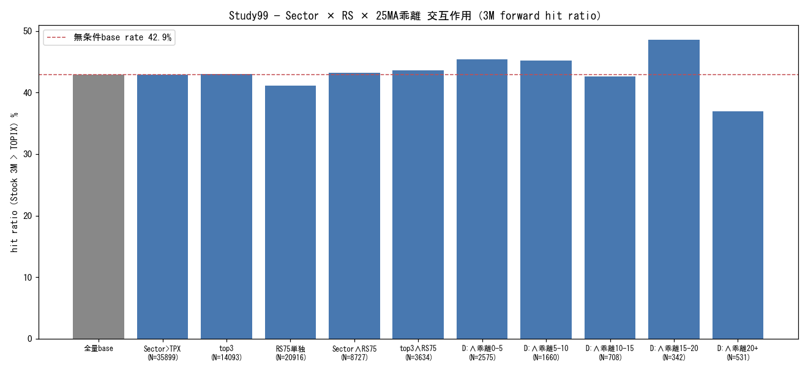

# Study99 — Sector × Fujiko filter 存在確認（factor-level・2026-07-16）

目的: P(Stock(t+3M)>TOPIX | Sector(t)>TOPIX) + RS score / 25MA乖離filterの交互作用。戦略BT不使用。

パネル: 行数=84,206・月数=105・期間=2017-08-01〜2026-04-01・Universe C（PIT）・forward=3M（63営業日）・セクター条件=公式TOPIX-17指数 3M trailing excess

統計注記: t(FM月次)=月次クラスタt（クロスセクション相関補正・主指標）。t(pooled)は銘柄間相関でN水増しのため参考値。3M forward窓は月次サンプリングで重複（自己相関により両tともやや過大）。RS=Universe C内パーセンタイル（プールサイズ依存・仮説4注記）。

## Analysis A — セクター条件単独

| 区分 | N | hit ratio | base rate | z | 平均excess 3M | t(pooled) | t(FM月次) |
|---|---|---|---|---|---|---|---|
| A: Sector>TOPIX（全量） | 35899 | 43.0% | 42.9% | 0.219 | -0.6% | 3.533 | 1.354 |
| A: Sector top3 | 14093 | 43.0% | 42.9% | 0.242 | -0.3% | 3.728 | 1.309 |

## Analysis B — RS score filter（60/70/75/80）

| 区分 | N | hit ratio | base rate | z | 平均excess 3M | t(pooled) | t(FM月次) |
|---|---|---|---|---|---|---|---|
| RS≥60 単独 | 33649 | 42.3% | 42.9% | -1.905 | -0.8% | 1.142 | 0.120 |
| RS≥70 単独 | 25176 | 41.6% | 42.9% | -3.716 | -1.0% | -0.554 | -0.378 |
| RS≥75 単独 | 20916 | 41.2% | 42.9% | -4.483 | -1.1% | -1.291 | -0.623 |
| RS≥80 単独 | 16671 | 40.4% | 42.9% | -5.918 | -1.4% | -2.450 | -1.059 |
| Sector>TOPIX ∧ RS≥60 | 14195 | 44.0% | 42.9% | 2.565 | 0.3% | 5.795 | 2.305 |
| Sector>TOPIX ∧ RS≥70 | 10516 | 43.8% | 42.9% | 1.775 | 0.4% | 4.683 | 2.062 |
| Sector>TOPIX ∧ RS≥75 | 8727 | 43.2% | 42.9% | 0.574 | 0.2% | 3.541 | 1.522 |
| Sector>TOPIX ∧ RS≥80 | 6893 | 42.7% | 42.9% | -0.316 | 0.1% | 2.603 | 0.723 |
| Sector top3 ∧ RS≥60 | 5755 | 44.4% | 42.9% | 2.257 | 0.8% | 4.962 | 2.172 |
| Sector top3 ∧ RS≥70 | 4326 | 44.2% | 42.9% | 1.753 | 0.8% | 3.943 | 1.926 |
| Sector top3 ∧ RS≥75 | 3634 | 43.6% | 42.9% | 0.897 | 0.7% | 3.366 | 1.764 |
| Sector top3 ∧ RS≥80 | 2857 | 43.2% | 42.9% | 0.282 | 0.4% | 2.341 | 0.788 |

## Analysis C — 25MA乖離率bin（単独）

| 区分 | N | hit ratio | base rate | z | 平均excess 3M | t(pooled) | t(FM月次) |
|---|---|---|---|---|---|---|---|
| 乖離<0%（参考） | 39736 | 42.6% | 42.9% | -1.072 | -1.0% | -0.828 | -1.600 |
| 乖離0〜5% | 28652 | 43.6% | 42.9% | 1.956 | -0.9% | -0.129 | 0.549 |
| 乖離5〜10% | 10059 | 43.8% | 42.9% | 1.724 | -0.7% | 1.392 | 0.046 |
| 乖離10〜15% | 3104 | 42.4% | 42.9% | -0.511 | -0.7% | 0.549 | 0.090 |
| 乖離15〜20% | 1202 | 41.5% | 42.9% | -0.958 | -0.4% | 0.509 | 0.145 |
| 乖離20〜∞% | 1453 | 34.5% | 42.9% | -6.373 | -1.7% | -0.543 | -0.355 |

## Analysis D — Combined interaction（Sector>TOPIX ∧ RS≥75 × 25MA乖離bin）

| 区分 | N | hit ratio | base rate | z | 平均excess 3M | t(pooled) | t(FM月次) |
|---|---|---|---|---|---|---|---|
| D: ∧乖離<0%（参考） | 2911 | 40.8% | 42.9% | -2.193 | -0.0% | 1.450 | 0.138 |
| D: ∧乖離0〜5% | 2575 | 45.4% | 42.9% | 2.492 | -0.1% | 1.989 | -0.850 |
| D: ∧乖離5〜10% | 1660 | 45.2% | 42.9% | 1.866 | -0.0% | 1.592 | 0.655 |
| D: ∧乖離10〜15% | 708 | 42.7% | 42.9% | -0.126 | -0.1% | 0.746 | 0.521 |
| D: ∧乖離15〜20% | 342 | 48.5% | 42.9% | 2.106 | 4.2% | 2.632 | 1.453 |
| D: ∧乖離20〜∞% | 531 | 36.9% | 42.9% | -2.776 | 2.0% | 0.875 | 0.670 |
| D: top3 ∧ RS≥75 ∧ 乖離0〜10% | 1832 | 45.8% | 42.9% | 2.486 | 0.6% | 2.852 | 1.900 |

## サブ期間（主要区分のみ）

| 期間 | 区分 | N | hit ratio | base rate | z | 平均excess 3M | t(FM月次) |
|---|---|---|---|---|---|---|---|
| 2016-2020 | A: Sector>TOPIX | 11442 | 41.0% | 43.1% | -4.029 | -1.6% | -3.225 |
| 2016-2020 | A: top3 | 5133 | 39.1% | 43.1% | -5.360 | -2.2% | -3.108 |
| 2016-2020 | B: Sector∧RS75 | 2453 | 38.8% | 43.1% | -4.202 | -2.0% | -2.070 |
| 2016-2020 | B: top3∧RS75 | 1138 | 37.8% | 43.1% | -3.576 | -2.1% | -1.408 |
| 2016-2020 | RS75単独 | 7748 | 39.9% | 43.1% | -5.119 | -1.8% | -1.342 |
| 2021-2025 | A: Sector>TOPIX | 22475 | 44.4% | 43.4% | 2.418 | -0.3% | 3.170 |
| 2021-2025 | A: top3 | 8168 | 44.8% | 43.4% | 2.334 | -0.1% | 2.321 |
| 2021-2025 | B: Sector∧RS75 | 5745 | 45.1% | 43.4% | 2.379 | 0.9% | 3.337 |
| 2021-2025 | B: top3∧RS75 | 2212 | 45.7% | 43.4% | 2.105 | 1.1% | 2.893 |
| 2021-2025 | RS75単独 | 12117 | 41.4% | 43.4% | -3.973 | -1.1% | -0.277 |

## Regime別（TOPIX>MA200・主要区分のみ）

| Regime | 区分 | N | hit ratio | base rate | z | 平均excess 3M | t(FM月次) |
|---|---|---|---|---|---|---|---|
| bull | A: Sector>TOPIX | 24471 | 41.9% | 41.6% | 0.808 | -0.9% | 2.644 |
| bull | A: top3 | 10035 | 42.3% | 41.6% | 1.433 | -0.3% | 1.921 |
| bull | B: Sector∧RS75 | 6078 | 42.3% | 41.6% | 1.091 | 0.0% | 1.883 |
| bull | B: top3∧RS75 | 2677 | 43.2% | 41.6% | 1.705 | 0.7% | 1.838 |
| bull | RS75単独 | 14826 | 40.1% | 41.6% | -3.320 | -1.7% | -0.684 |
| bear | A: Sector>TOPIX | 11428 | 45.3% | 46.1% | -1.316 | -0.0% | -1.767 |
| bear | A: top3 | 4058 | 44.7% | 46.1% | -1.628 | -0.2% | -1.114 |
| bear | B: Sector∧RS75 | 2649 | 45.3% | 46.1% | -0.700 | 0.7% | -0.389 |
| bear | B: top3∧RS75 | 957 | 44.8% | 46.1% | -0.745 | 0.8% | 0.220 |
| bear | RS75単独 | 6090 | 43.9% | 46.1% | -3.010 | 0.3% | -0.105 |

---

*生成: Study99自動分析パイプライン, 2026-07-16。戦略BT不使用（factor-level統計のみ）。セクター分類=companies.parquetスナップショット（非PIT・Study95と同一注記）。RS閾値はProduction採用パラメータではない（統治原則3）。*